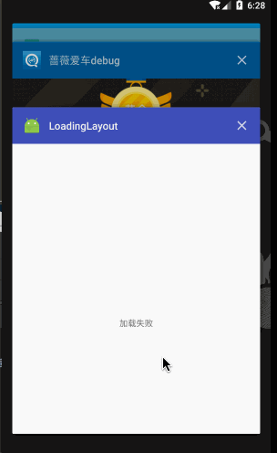

这次，我又推倒重做了=_=，自己都被自己折服了，这次做的是完全解耦的加载布局，不会像之前那样，在根布局添加一个加载布局，这样太耦合，还有ViewPager+Fragment+加载布局，这个比较坑，因为涉及到懒加载的问题，下面我再说吧

### 使用

具体可以看MainActivity类，下面贴一小段代码


```
    WQLoad wqLoad;

    @Override
    protected void onCreate(Bundle savedInstanceState) {
        super.onCreate(savedInstanceState);
        setContentView(R.layout.activity_main);


        wqLoad = new WQLoad.Builder(this)
                    .addLoadingCallBack(new LoadingLayout(this))
                    .addEmptyView(new EmptyLayout(this))
                    .addErrorView(new ErrorLayout(this))
                    .build();
                    
        wqLoad.init(this);

        wqLoad.showLoadingView();
        findViewById(R.id.main_content).postDelayed(new Runnable() {
            @Override
            public void run() {
                wqLoad.showErrorView();
            }
        }, 2000);
    }

    //模拟请求网路
    @ErrorClick
    public void pullNet() {
        wqLoad.showLoadingView();
        findViewById(R.id.main_content).postDelayed(new Runnable() {
            @Override
            public void run() {
                wqLoad.showContentView();
            }
        }, 2000);
    }

```

>说明

初始化WQLoad采用Builder模式，可以随意添加不同页面的加载布局，看一下正在加载布局,就是提供一个布局

```
public class LoadingLayout extends CallBack {

    public LoadingLayout(Context context) {
        super(context);
    }

    @Override
    protected View onCreateView() {
        return LayoutInflater.from(getContext()).inflate(R.layout.loading_load, null, false);
    }
}


```


 wqLoad.init(this)的this主要有两层功能：
 一层是通过this获取到是否是Activity，如果是的话，通过activity.findViewById(android.R.id.content)拿到根布局的父布局，这样，我们就可以根据这个父布局进行addView来切换不同的布局。
 另一层意思就是反射，通过点击错误布局，寻找this所在类的带有ErrorClick注解方法的，然后invoke，这样点击错误布局就通过反射进行解耦，比回调方便的多
 
 
 
### ViewPager+Fragment+WQLoad

具体看TabFragment

这个比较坑的一点是，onCreateView 会执行很多次，我是通过懒加载的lazyLoad操作布局，lazyLoad 拿到了设置的mView，但是由于onCreateView的多次执行，导致mView已不是lazyLoad持有的mView，所以，这里我加了个判断，如果mView为空的再去加载布局


记得用lazyLoad去初始化布局，还有WQLoad，然后，Fragment中的初始化需要带上mView，this还是和Activity一样，为了反射
```
    @Override
    public void lazyLoad() {

        wqLoad = new WQLoad.Builder(getActivity())
                .addLoadingCallBack(new WQLoadingLayout(getActivity()))
                .build();
        wqLoad.init(this, mView);
        wqLoad.showLoadingView();

        mView.findViewById(R.id.tab_tx).postDelayed(new Runnable() {
            @Override
            public void run() {
                wqLoad.showErrorView();
            }
        }, 2000);
    }


    @ErrorClick
    public void pullNet() {
        wqLoad.showLoadingView();
        mView.findViewById(R.id.tab_tx).postDelayed(new Runnable() {
            @Override
            public void run() {
                wqLoad.showContentView();
            }
        }, 2000);
    }

```

### 效果图

